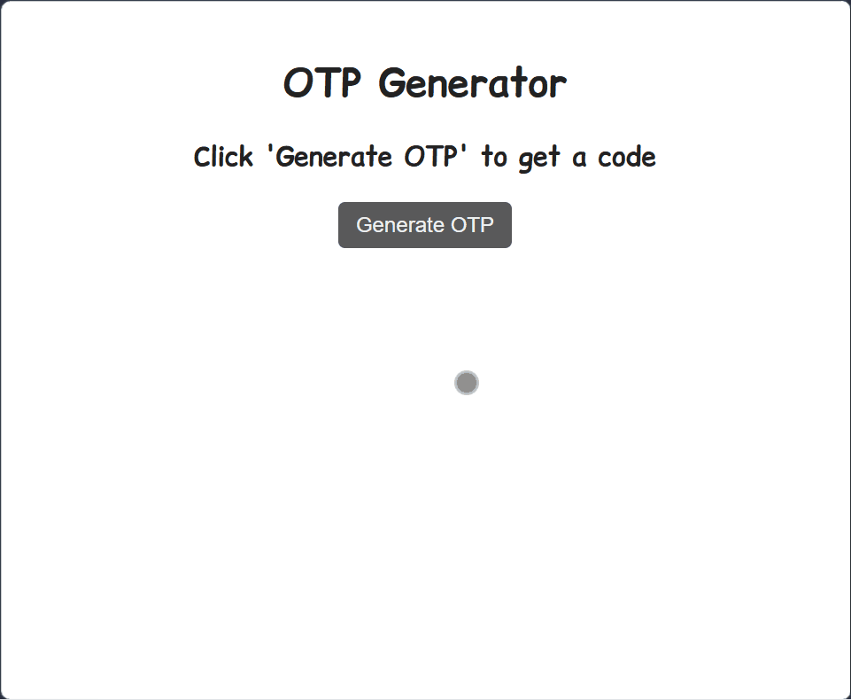

# 🔐 OTP Generator

An interactive OTP (One-Time Password) generator built with React, Vite, and TypeScript.
This project demonstrates practical use of React hooks (useState, useEffect) to manage state and side effects while generating secure OTPs.

---

## 🚀 Live Demo

[View Project](https://himanshu-kumar-2301.github.io/fcc-otp-generator/)

---

## 🛠️ Tech Stack

- **React 19** - UI components
- **TypeScript** - type safety
- **Vite** - build tool & dev server
- **ESLint** - linting & code quality

---

## 📸 Preview



---

## 📚 Features

- Dynamic OTP generation using random number logic.
- React Hooks:
  - useState → manages OTP value and UI state.
  - useEffect → handles auto-refresh or side effects (e.g., resetting OTP after a timeout).
- Responsive UI with clean styling.
- Built with Vite for fast development and bundling.
- Written in TypeScript for type safety.

---

## 📂 Project Structure

```code
root/
|--public/
|--src/
|  |--styles.css
|  |--main.tsx
|  |--components/
|  |  └──OTPGenerator.tsx
|  └──assets/
|     └──screenshot.gif
|--index.html
|--package.json
|--vite.config.ts
|--tsconfig.json
|--README.md
```

---

## 🧑‍💻 How to Run Locally

1. Clone the repo:

    ```bash
    git clone https://github.com/Himanshu-Kumar-2301/fcc-otp-generator.git
    ```

2. Navigate into the folder

    ```bash
    cd fcc-otp-generator
    ```

3. Install dependencies

    ```bash
    npm install
    ```

4. Start the dev server

    ```bash
    npm run dev
    ```

---

## 📖 Learning Highlights

- Managing stateful UI with useState.
- Handling side effects (timers, auto-refresh) with useEffect.
- Structuring a TypeScript + React + Vite project for scalability.

---
